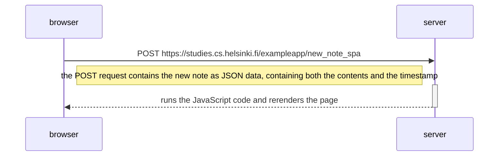

```mermaid
sequenceDiagram
  participant browser
  participant server
  
  browser->>server: POST https://studies.cs.helsinki.fi/exampleapp/new_note_spa
  
  Note right of browser: the POST request contains the new note as JSON data, containing both the contents and the timestamp
  
  activate server
  server-->>browser: runs the JavaScript code and rerenders the page
  deactivate server
```
